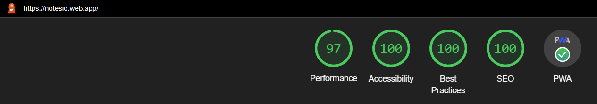

# Welcome to NOTES.ID: Notes Your Future

Hosting URL: [NOTES.ID: Notes Your Future](https://notesid.web.app/).

## Tech Stacks

- React.js v18.2.0 (Hooks)
- Font Awesome v6.1.1
- Firebase v9.8.4
- Node.js v18.4.0
- Npm v8.12.1

## Features

- Create Notes
- List Notes
- Update Notes
- Update Notes Status
- Delete Notes

## Performances

### `npm start`

Runs the app in the local mode.\
Open [http://localhost:3000](http://localhost:3000) to view it in your browser.

The page will reload when you make changes.\
You may also see any lint errors in the console.
